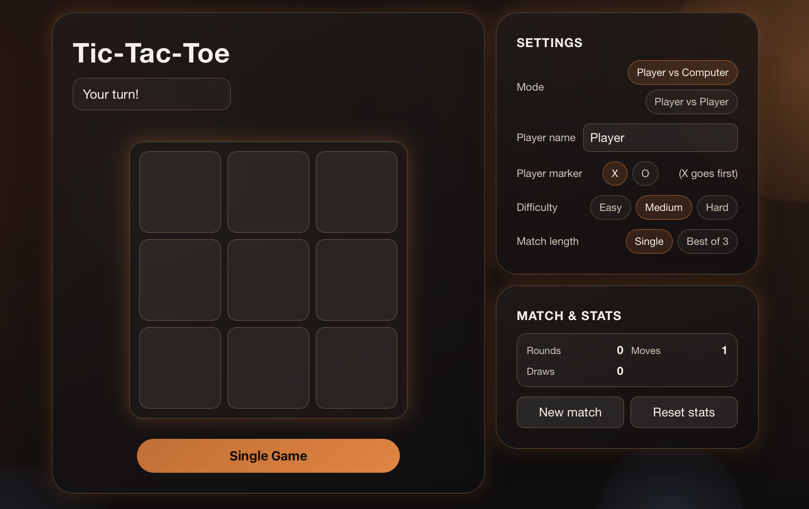

> This project was built as a fun side project to practice a structured Codex CLI workflow.
> Development follows a spec-driven loop using `AGENTS.md` (execution rules) and `SPEC.md` (feature checklist).
> Work is completed in tight TDD cycles: write one failing test, implement the minimum fix, pass tests, then check off one spec item.

# Tic-Tac-Toe (Codex Workflow Project)



Browser-based tic-tac-toe built with HTML, CSS, and JavaScript, developed through a spec-driven workflow using `AGENTS.md` and `SPEC.md`.

## Quick Start

Follow these steps to run the game locally from this GitHub repository:

1. Clone the repository:

```bash
git clone https://github.com/christopherbolduc/tic_tac_toe.git
```

2. Move into the project folder:

```bash
cd tic_tac_toe
```

3. Install dependencies:

```bash
npm install
```

4. Start the local server:

```bash
npm run start
```

5. Open `http://localhost:8080` in your browser.

6. To stop the server, press `Ctrl + C` in the terminal.

## How To Play

1. Choose mode (`Player vs Computer` or `Player vs Player`).
2. Set options like difficulty, match length, and markers.
3. Click a square (or use keyboard controls) to make moves.
4. Win by placing three markers in a row, column, or diagonal.

## Features

### Gameplay
- `PvC` and local `PvP` modes
- Difficulty levels: `Easy`, `Medium`, `Hard` (minimax on hard)
- Match formats: single game, best-of-3
- Player naming and marker selection (`X`/`O`)

### UX and Accessibility
- Keyboard navigation across the board
- Enter/Space support for moves
- Live status messaging for turn updates and outcomes
- Motion effects with reduced-motion support

### Stats and Analytics
- Persistent scoreboard (wins, losses, draws, streaks)
- Persistent settings in `localStorage`
- Analytics counters such as total rounds, total moves, and average moves per round

## Tech Stack

- HTML5
- CSS3
- Vanilla JavaScript (CommonJS modules)
- Node.js test runner (`node --test`)
- Static local server via Python (`python3 -m http.server`)

## Run Tests

```bash
npm test
```

## Project Structure

```text
tic_tac_toe/
├── AGENTS.md           # Workflow instructions for Codex
├── LICENSE             # MIT license text
├── README.md           # Project docs and usage guide
├── SPEC.md             # Final implementation scope
├── .gitignore          # Git ignore rules (dependencies, logs, coverage)
├── ai.js               # AI strategy by difficulty
├── game.js             # Core game logic
├── game.test.js        # Automated tests
├── index.html          # UI structure and controls
├── main.js             # App orchestration and state flow
├── package.json        # Node scripts and project metadata
├── ttt_screenshot.png  # README gameplay image
└── ui.js               # UI updates/render helpers
```

## AI Behavior

- `Easy`: legal random moves
- `Medium`: heuristic-based decision making
- `Hard`: minimax strategy (designed to avoid losing with optimal play)

## Development Workflow

This project was built using a strict TDD loop with a `next` command pattern:

1. Pick the next unchecked item in `SPEC.md`
2. Write one failing test
3. Implement the minimum change to pass
4. Re-run tests and check off the item

`AGENTS.md` defines the operating workflow used during development. `SPEC.md` captures the finalized implementation scope for this project.

## Completed Scope

Shipped scope, as reflected in [`SPEC.md`](SPEC.md):
- Game modes: `PvC` and local `PvP`
- AI difficulty levels: `Easy`, `Medium`, `Hard` (minimax)
- Persistent stats/settings with reset actions
- Best-of-3 match flow with match winner handling
- Player personalization (name/marker) and PvP naming
- Keyboard-first accessibility and semantic control labels
- Motion/feedback improvements with reduced-motion support
- Lightweight analytics panel with persistence/reset behavior

Final manual validation outcomes:
- Mobile and desktop layouts remain usable and clear
- Keyboard-only play works in both `PvC` and `PvP`
- `Hard` AI does not lose in repeated manual trials
- Match flow and persisted restore behavior are correct

## License

This project is licensed under the MIT License. See the [`LICENSE`](LICENSE) file for details.

## Author

**Christopher Bolduc**
[LinkedIn](https://www.linkedin.com/in/christopher-david-bolduc/) • [GitHub](https://github.com/christopherbolduc)
